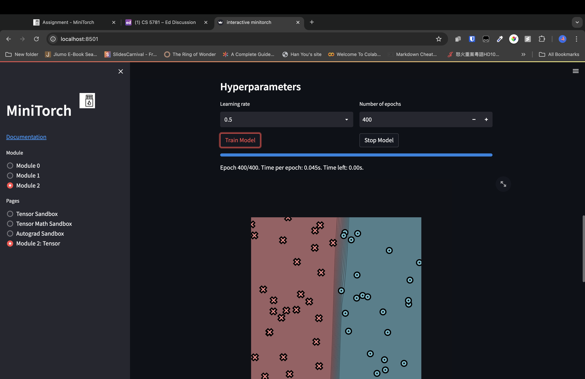
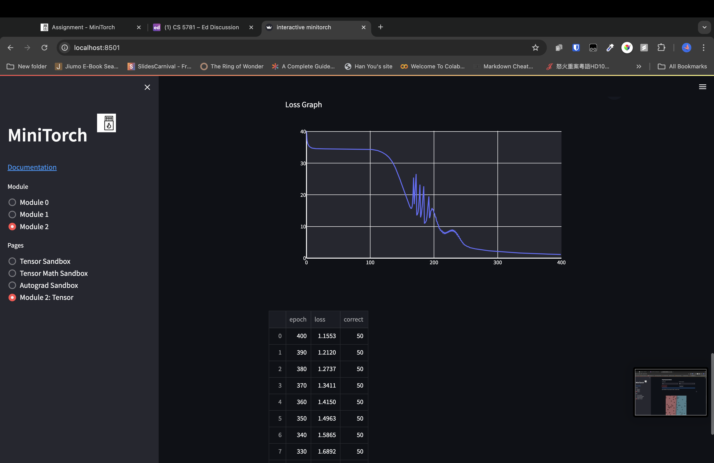
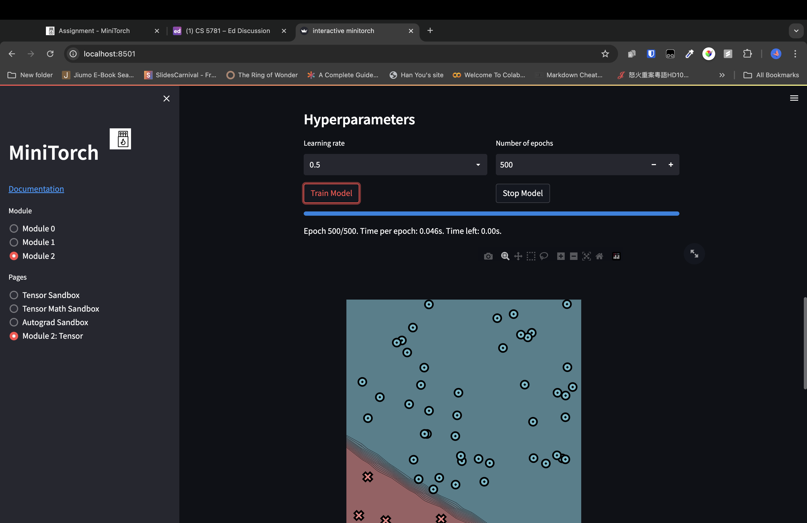
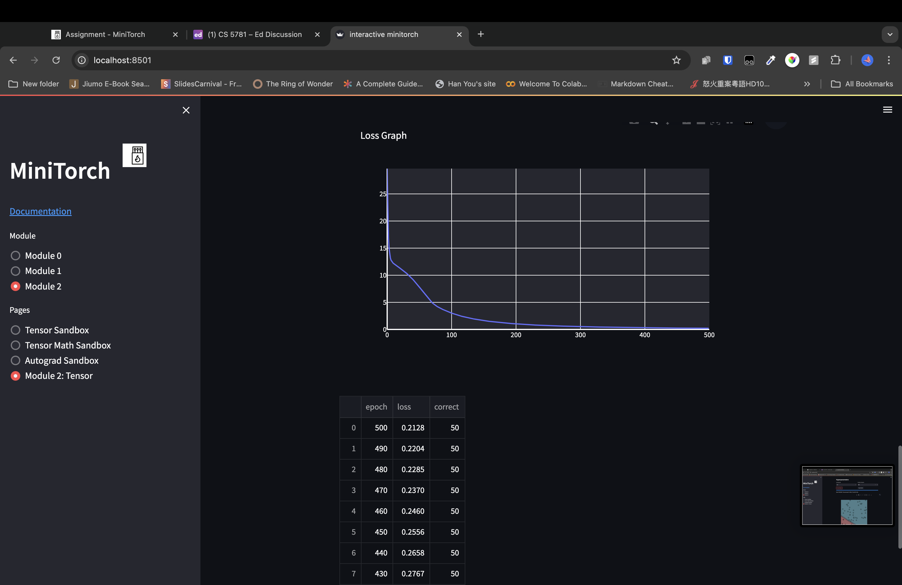
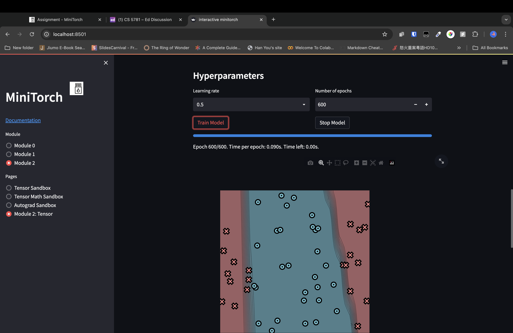
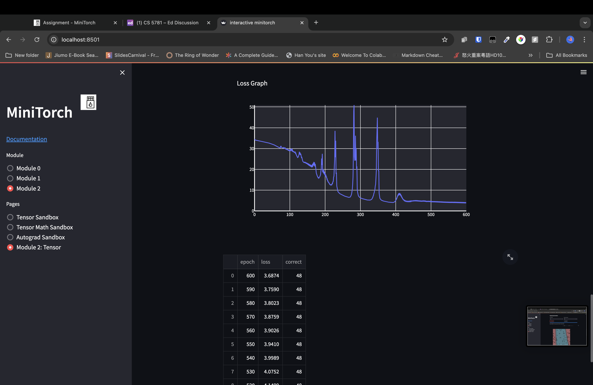
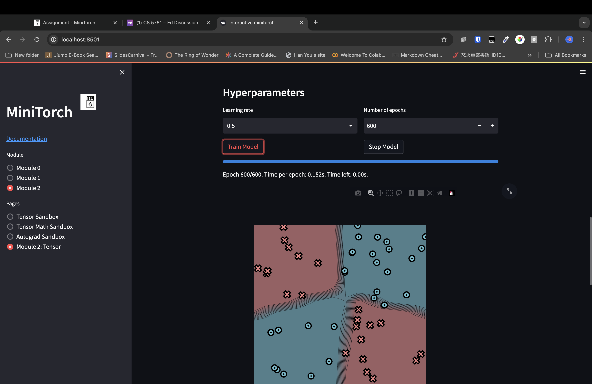
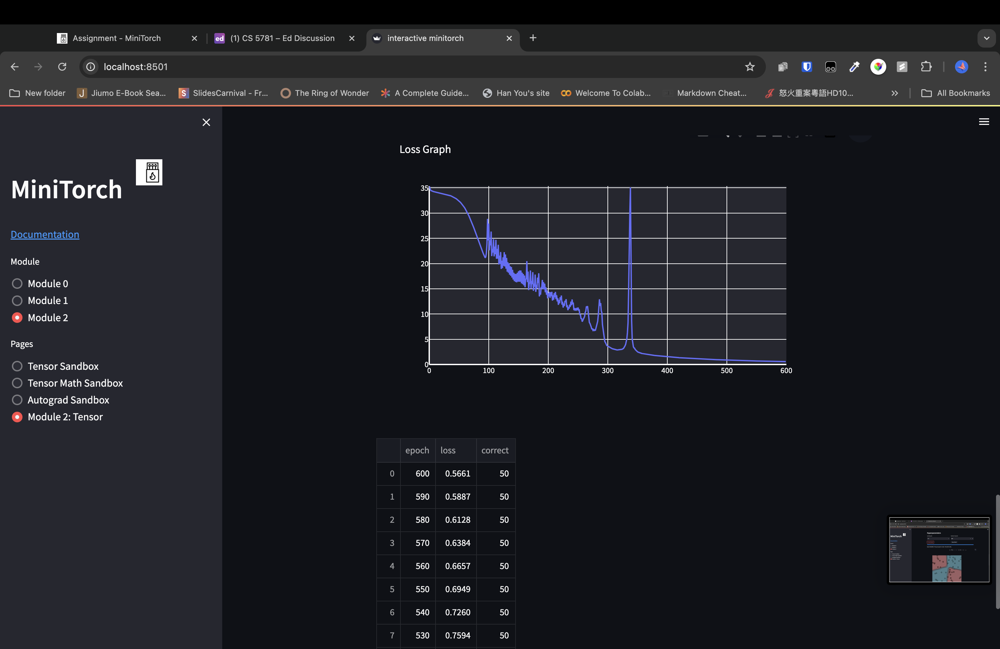

[](https://classroom.github.com/a/YFgwt0yY)
# MiniTorch Module 2


* Docs: https://minitorch.github.io/

* Overview: https://minitorch.github.io/module2/module2/

This assignment requires the following files from the previous assignments. You can get these by running

```bash
python sync_previous_module.py previous-module-dir current-module-dir
```

The files that will be synced are:

        minitorch/operators.py minitorch/module.py minitorch/autodiff.py minitorch/scalar.py minitorch/scalar_functions.py minitorch/module.py project/run_manual.py project/run_scalar.py project/datasets.py

# 2.5 task


Hidden layer = 2, Time per epoch = 0.045s




Hidden layer = 2, Time per epoch = 0.046s



Hidden layer = 4, Time per epoch = 0.090s



Hidden layer = 6, Time per epoch = 0.152s


